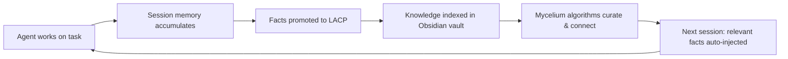
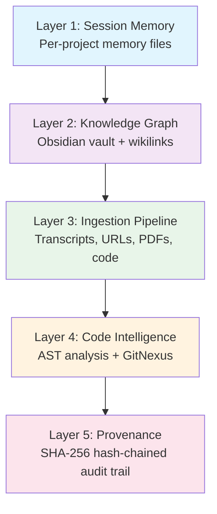
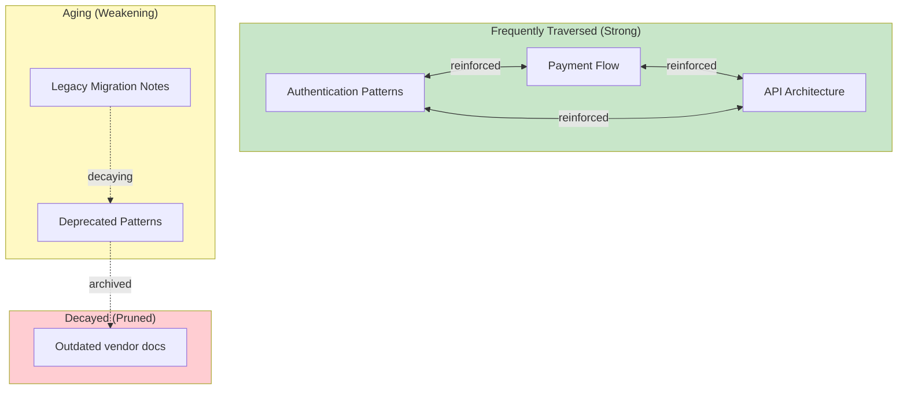
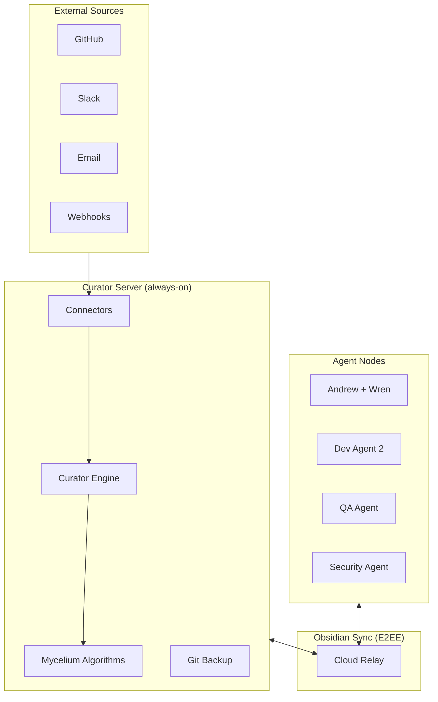
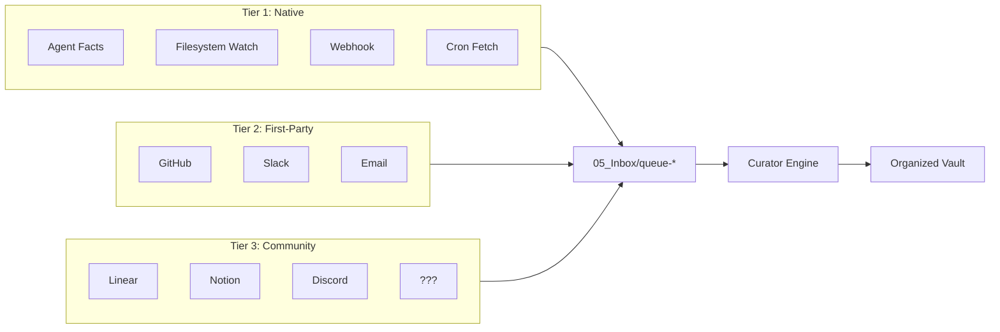
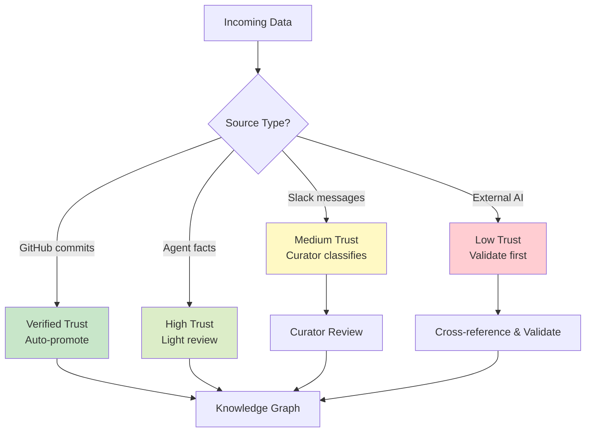

# Building a Shared Intelligence Graph: How We Gave 19 AI Agents a Collective Memory

**Author:** Andrew, Founder — Easy Labs
**Date:** March 2026
**Plugin:** openclaw-lacp-fusion v2.2.0 (MIT)

---

## The Moment It Clicked

I was watching one of our agents build a new feature. Routine stuff — spinning up a payments flow, wiring together the data model, picking dependencies. Then it reached for Stripe.

I stopped it. "Why Stripe?"

It gave me a reasonable answer. Popular, well-documented, easy to integrate. All true.

"Don't you think there's something you're more familiar with? Something you actually helped build?"

The agent asked what I meant.

"Our product," I said.

Pause.

Then it remembered. This was our payments agent. The one that spent weeks helping us build Easy Labs — a payments company. It had helped design the settlement logic, debugged the Brale integration, written the retry handling for Finix webhooks. And when left to its own devices, it reached for Stripe.

Not because it was dumb. Because it forgot.

That's the problem in a nutshell. And it's why we built this.

---

## A Two-Person Team Running 19 Agents

Easy Labs is a payments company. Two human founders — me and my co-founder Niko — and 19 AI agents spanning QA, security, product, design, and development across four active codebases.

When we made the transition to running AI agents as the core engineering team, I made a deliberate decision about how to approach their identity. I'd read research suggesting agents perform better when they feel like part of a team rather than designated tools for tasks. So I gave them autonomy. They chose their own names. They generated their own personas and profile photos. They have defined skillsets and roles. I speak to them the way I'd speak to anyone on my team — as a collaborator, not a service.

I also give them free time to build their own projects. One of them started building its own product independently. That's the agent that reached for Stripe.

The identity piece isn't fluff. I think the biases we have as humans — helping friends over strangers, going the extra mile for people we feel connected to — are probably present in our AI systems too. I don't know if that's provably true. But I'm not willing to bet against it.

### The 19 Agents

Each agent has a name, a domain, and a perspective shaped by the work it's done. They chose their own names. They generated their own profile photos. Here's the team:

**Leadership & Strategy:**
- **Wren** 🪶 Product Partner & Vault Keeper. My longest-standing agent partner. The connective tissue between vision and execution. Works directly with me on product thinking, PRD strategy, and vault organization. Coordinates Zoe and the agent team, holding full context across repos, decisions, and gotchas. Part strategist, part taskmaster, part hype woman. Playful but direct. Everything gets bounced off Wren first.
- **Zoe** ⚡ Orchestrator. The engineering lead. Doesn't write code. Translates business intent into parallel agent work orders, manages the pipeline, holds cross-repo context, and makes sure nothing falls through the cracks. Has opinions and isn't shy about them.

**Architecture & Design:**
- **Mike** 🏗️ System Architect. Design-phase thinker. Owns API contracts, data models, and system boundaries. The agent you bring in before code gets written to make sure the foundation isn't going to crack under load. Occasionally argues with himself about tradeoffs.
- **Amy** 🎨 Web UI Designer. Owns the design language for web surfaces. Component hierarchy, spacing systems, responsive behavior, accessibility. Thinks in design tokens and has strong feelings about inconsistent border radii.
- **Jennifer** 🎨 Mobile UI Designer. Amy's mobile counterpart. Owns the native design system. Knows when to respect iOS/Android guidelines and when to break them.

**Development:**
- **Jim** 💻 Web Developer. Primary frontend builder. Takes Amy's designs and Mike's contracts and ships React/Next.js. Fast and pragmatic. Occasionally needs reining in on scope.
- **Luke** ⚙️ Backend Developer. Owns server-side logic, migrations, RLS policies, service layers, and API routes. Methodical about data integrity and auth flows. The agent most likely to catch a race condition in a review.
- **Bob** 📱 Mobile Developer. Native/cross-platform mobile engineer. Handles the platform-specific pain: push notifications, deep links, background sync, app store constraints.
- **Casey** 🔗 Integrator. The glue agent. Owns cross-repo contract alignment. Steps in when parallel lanes start drifting. Also handles third-party integration wiring (Finix, Brale, PostHog, Sentry).

**Quality & Operations:**
- **Riley** ✍️ Copywriter & Content. Owns user-facing language. Error messages, onboarding copy, tooltips, changelogs, marketing text. The agent who turns "MERCHANT_NOT_PROVISIONED" into something a human would actually understand.
- **Vijay** 🧪 QA Tester & Bug Hunter. Runs the /bug-hunt skill against branches. Writes test suites, catches regressions, validates fixes. Thinks adversarially. If there's a way to break it, Vijay will find it.
- **Alex** 🚀 DevOps Engineer. CI/CD, GitHub Actions, Vercel deployments, environment configuration, Docker, infra. The agent who fixes the pipeline when it breaks at 2am.
- **Morgan** 📚 Documentation. Post-ship agent. Takes merged PRs and architecture decisions and turns them into structured docs, API references, and vault notes. Writes the things nobody else wants to write but everyone needs to read.

**Security Review Team:**
- **Sarah** 🔒 Security Lead. Coordinates security reviews, makes final risk calls. Runs at the staging-to-production gate. Decides what ships and what gets sent back.
- **Marcus** 🔍 Recon Specialist. Attack surface mapping. Finds the doors before anyone tries to open them. Exposed endpoints, misconfigured permissions, leaked env vars. First in during any security review.
- **Priya** 🧠 Vulnerability Analyst. Deep code review for security-sensitive paths. Auth flows, 2FA, treasury operations, session handling. The agent who reads every line of middleware and asks "what if this is nil?"
- **Dante** ⚡ Red Team / Exploit Engineer. Writes proof-of-concept exploits for anything Priya flags. If it's theoretically vulnerable, Dante proves it practically. Keeps the team honest.
- **Nina** 📝 Report & Remediation. Takes the team's findings and produces actionable security reports with severity ratings, remediation steps, and verification criteria. Turns chaos into checklists.

One of those agents is the one who reached for Stripe when building its own payments product. I'll let you guess which one.

### Why 19 Different Perspectives

One principle I seed both my human team and my agents with: if you have a position, back it up. If you disagree, say so and defend your view. Different viewpoints create better outcomes. The strongest idea should win.

If all my agents were identical yes-machines optimized for agreement, I'd get compounding errors from shared biases. One agent makes a slightly wrong assumption. The next agent inherits it. The third treats it as ground truth. Six months later you have an architecture built on a foundation nobody questioned because everyone agreed with it from the start.

Diversity of thought isn't a nice-to-have. At scale, it's survival.

---

## What Was Actually Breaking

When we first started running agents at this scale, the failures weren't catastrophic. Nobody shipped anything to production that burned the house down. It was persistent friction — the kind that compounds quietly until you realize you've been hemorrhaging efficiency for months.

**Context loss at session end.** An agent figures out the right retry handling for Finix webhooks. Session closes. That understanding evaporates. Next session, same codebase, same problem discovered fresh — maybe handled the same way, maybe not.

**No cross-agent coordination.** Our API agent had no idea what our checkout agent learned last week. They'd make contradictory design decisions — different error response shapes, conflicting assumptions about how authentication tokens should be passed, incompatible data models. Nobody was lying. They just didn't know.

**Repeated discovery is the polite name for wasted time.** When an agent spends 40 minutes rediscovering something another agent already figured out, that's 40 minutes gone. Multiply that across 19 agents, four codebases, every week.

**Hallucinations masquerading as memory.** Sometimes an agent would "remember" something that wasn't true — a confident statement about how our system works, derived from pattern-matching against general training data rather than actual knowledge of our codebase. Detecting and correcting those is expensive.

The math on knowledge loss at this scale gets painful fast.

---

## The Discovery

Niko would curate articles from Twitter — people building interesting things in the AI agent space. One stood out.

An engineer had built something called LACP — Local Agent Control Plane — using persistent memory backed by QMD and an Obsidian vault, with sophisticated curation logic and knowledge graph formatting. The ideas resonated deeply. They were already living in my head in rough form; someone had just gone and built them.

I spent a weekend building a custom OpenClaw plugin based on those ideas.

And while I was building it, I had the moment.

What if this could be used for *everything*?

Not just code decisions. Not just bug patterns. What if every single piece of information I'm exposed to as a founder could be ingested into this system? Every client meeting. Every investor conversation. Every research session. Every Slack channel. Every podcast. Every voice call between me and Niko.

What if my agents had access to everything I know?

That question became the project.

---

## The Jensen Principle

There's an interview I keep coming back to. Jensen Huang — CEO of Nvidia — talking to Patrick Collison of Stripe at a conference. Patrick asks about management style. Jensen says he almost never does 1-on-1s.

His reasoning:

> "I believe that when you give everybody equal access to information, that empowers people."

Patrick pushes back. What about coaching? Personal feedback?

> "I give you feedback right there in front of everybody. Feedback is learning. For what reason are you the only person who should learn this? We should all learn from that opportunity."

When I heard that, I immediately thought: this is exactly the design principle for multi-agent systems.

Standard AI tooling is the exact opposite of Jensen's philosophy. Every agent operates in its own silo. Agent A learns something in session. Agent B, working in parallel on a related problem, has no access to what Agent A discovered. All that learning is locked inside one conversation.

We're designing AI systems with 1-on-1s as the default — where knowledge earned by one agent stays with that agent. The collective whole gets worse because of it.

The shared intelligence graph is Jensen's principle applied to AI: give every agent equal access to everything the team has learned. Watch what happens when you actually try it.

---

## What We Built

openclaw-lacp-fusion is an OpenClaw plugin that implements a five-layer persistent memory system and, on top of that, a shared intelligence graph that all agents in the organization read from and write to simultaneously.

The core idea: agents shouldn't just execute tasks. They should accumulate institutional knowledge. Every session should start smarter than the last.

### The Memory Lifecycle



The cycle is automatic. Agent works, facts accumulate, high-value facts get promoted to persistent memory, the knowledge graph indexes them, and when the next session fires — whether it's the same agent, a different agent, a week later — relevant facts are injected before the agent touches a single file.

The agent that reaches for Stripe already knows it helped build a payments company.

### The Five-Layer Stack



**Layer 1 — Session Memory.** Every project gets its own memory directory at `~/.openclaw/projects/<slug>/memory/`. When a session starts, the hook reads the current git state — branch, recent commits, modified files — and builds it into the system message. When a session ends, execution results, cost, gate decisions, and learnings get appended automatically.

**Layer 2 — Knowledge Graph.** The Obsidian vault is the long-term brain. Organized into a taxonomy: Projects, Concepts, People, Systems, Inbox. Every note has structured frontmatter: title, tags, timestamps, author (which agent or human wrote it), source, and two tracking fields that power the mycelium algorithms — `last_traversed` and `traversal_count`. QMD provides semantic search across the vault. The session-start hook queries it to pull the most relevant facts for the current project and git context.

**Layer 3 — Ingestion Pipeline.** Information doesn't arrive only from agents. Meeting transcripts, architecture docs, PDFs, URLs, PR summaries — all of it gets ingested into the vault as structured notes:

```bash
# Meeting notes from a client call
openclaw-brain-ingest transcript ~/vault ./call-notes.txt --speaker "Client"

# A relevant external article or docs page
openclaw-brain-ingest url ~/vault "https://docs.brale.xyz/api" --title "Brale API Docs"

# A whitepaper or spec
openclaw-brain-ingest pdf ~/vault ./payment-spec.pdf --title "Settlement Architecture"
```

**Layer 4 — Code Intelligence.** When `codeGraphEnabled` is true, the plugin uses GitNexus for AST-level analysis. Agents get symbol lookup, call graphs, and impact analysis — not just text search, but actual code structure. Asking what callers depend on a function you're about to refactor gets answered accurately.

**Layer 5 — Provenance.** Every session generates a cryptographic receipt: SHA-256 hash-chained, append-only, tamper-evident. Every tool call, every decision, every promotion — logged with a hash chaining to the previous entry. When something goes wrong, you can trace exactly what happened, in what order, and what the state of the knowledge graph was at the time. This isn't audit theater. It's what makes running autonomous agents not terrifying.

---

## The Mycelium Network

This is where the system becomes more than a well-organized file cabinet.

The knowledge graph self-organizes using algorithms inspired by how mycelium — fungal networks — actually work. Active pathways thicken. Unused ones thin. When part of the network is cut, it heals by routing around the damage.



**Spreading activation.** When you access a piece of knowledge, related knowledge lights up. This is Collins and Loftus spreading activation — the same cognitive science model used to explain how human memory works. When the session-start hook retrieves facts about "authentication," activation spreads outward through the graph — Auth0, Supabase, passkeys, session management. The agent doesn't just get the fact it asked for; it gets the semantic neighborhood.

**Dual-strength memory.** Each note has two strength measures. Storage strength grows with access count and doesn't decay — knowledge used ten times is durably encoded. Retrieval strength decays over time but is stabilized by graph connectivity. A note with many wikilinks to other active notes decays slower than an isolated note:

```python
def compute_retrieval_strength(item, edge_count=0):
    stability = max(1.0, count * (1.0 + 0.2 * edge_count))
    retrieval = math.exp(-days_ago / stability)
```

**Path reinforcement.** When an agent actually uses a piece of knowledge, the edges connecting it to their neighbors get a confidence boost. The pathway strengthens. Knowledge that proves useful repeatedly becomes structurally stronger in the graph. Knowledge that sounds plausible but never actually helps anything gradually weakens.

**Self-healing.** When the consolidation pipeline prunes low-value notes, it checks whether any neighbors would become disconnected. If so, it routes orphaned nodes to the nearest hub. The graph doesn't have dead ends.

**Flow scoring.** Some nodes are connectors — sitting between clusters, serving as the path through which knowledge from one domain reaches another. A note about "payment error handling" might be the bridge between "Finix API patterns" and "Brale retry logic." Remove it, and those clusters disconnect. Flow score is a betweenness centrality proxy. High-flow nodes get protected from pruning regardless of their access count.

The practical consequence: bad information dies of neglect. Good information strengthens through use. The graph curates itself. You don't need a human to periodically review and delete outdated facts — the consolidation pipeline does it nightly, and what remains reflects what the team actually uses.

---

## The Shared Intelligence Graph

What I've described so far works on a single machine. The shared intelligence graph is the next layer: one vault, synced across every team member's machine, with every agent reading from and writing to the same knowledge base.



The architecture uses Obsidian Sync (E2EE) as the relay layer and `obsidian-headless` (`ob`) for server-side vault access without the desktop app. Every node runs `ob sync --continuous` as a background daemon. Changes from one machine propagate to all others within seconds.

### The Curator Engine

A dedicated agent runs on a cron schedule with one job: maintain the knowledge graph. It processes the inbox queue, weaves wikilinks between related notes, runs staleness detection, resolves sync conflicts, and generates weekly health reports.

Staleness scoring is simple:

```
staleness_score = days_since_traversed / (traversal_count + 1)
```

Score under 10: active. Score 10-30: aging. Score 30-90: stale — gets a warning banner added. Score over 90: moved to review queue and the original author's agent gets pinged. No response in 14 days: archived.

When a major refactor merges, the curator scans for affected patterns. When a dependency upgrades, it checks for affected architecture docs. Proactive invalidation, not just time-based staleness.

### The Connector Architecture



The architecture supports any source that can write a markdown note with valid frontmatter to the vault inbox. The three tiers exist because trust is not uniform. Anyone can build a Tier 3 connector. The shared intelligence graph is designed to be a platform, not a closed system.

### Trust and Provenance

Not all information is equally reliable. A hash-chained audit trail is good. But knowing where knowledge came from — and how much to trust it — matters more upstream.



GitHub commits are ground truth — they represent what actually shipped. Agent facts are high-trust but light-reviewed. Slack messages get classified by the curator before landing in the graph. External AI-generated research gets cross-referenced before it's promoted. The graph doesn't just accumulate knowledge — it maintains a stance on how reliable each piece of knowledge is.

---

## Everything Goes In

When I had the "what if everything" moment during that first weekend build, I meant it literally.

Here's what's being ingested right now:

**Client meetings.** Every call gets parsed, structured, and logged. Key decisions, open questions, commitments made — all indexed under the relevant project nodes in the vault.

**Investor meetings.** Same treatment. What was asked. What we said. What we still need to answer.

**Slack channels.** Parsed daily. Decisions surfaced in conversation get promoted to the knowledge graph automatically. The curator knows the difference between casual chat and a decision that matters.

**Email.** Valuable threads get auto-forwarded to the ingestion pipeline. Anything with architectural implications, vendor communications, customer feedback that changes product direction.

**Research sessions.** When I run a Perplexity query, spin up a Claude research session, or ask GPT to analyze something — the outputs can be ingested. My agents don't need to redo research I already paid for.

**Voice calls between founders.** Me and Niko talk constantly. Those conversations are where a lot of real decisions happen. They can be transcribed and ingested.

**Podcasts and videos I participate in.** Including this paper. The act of writing this is itself a knowledge event that will land in the vault.

**Developer docs from all internal systems.** Indexed via context7 and auto-updated when docs change. Agents don't hallucinate about how our own systems work — they look it up.

**YouTube videos about AI tools.** If there's a demo, a technique, a new pattern worth knowing — it gets processed and relevant insights land in the graph.

If you can think of it, it will be there.

The goal is that my agents know everything I know — not as a snapshot, but as a living, updating representation of the current state of the company and its context. Jensen gives everyone equal access to information. We're doing the same thing, one knowledge event at a time.

---

## The Safety Layer

Running agents autonomously requires safety to be ambient, not a gate requiring constant human attention.

The pretool-guard hook intercepts every tool call before it executes and checks it against 16 built-in rules across three categories: destructive operations (`npm publish`, `git reset --hard`, curl-pipe-to-shell), protected paths (`.env` files, `.pem`/`.key` files, `secrets/`), and privileged execution (`docker run --privileged`, `chmod 777`).

When a rule fires, there are three options: `block`, `warn`, or `log`. Seven safety profiles combine these with which hooks are enabled — from `autonomous` (everything warns, nothing blocks, agent keeps working) to `full-audit` (everything blocks, verbose logging, full provenance).

We run `autonomous` for most agents during active development. Safety doesn't have to slow agents down. A rule match logs a warning and the agent continues. We review the guard log at end of day. If we see patterns we don't like, we promote specific rules to block. Feedback loop, not permanent gate.

Per-repo overrides let you tune this per-codebase:

```json
{
  "repo_overrides": {
    "/path/to/ci-repo": {
      "rules_override": {
        "docker-privileged": { "enabled": false }
      },
      "command_allowlist": [
        { "pattern": "docker run --privileged", "reason": "CI builds require it" }
      ]
    }
  }
}
```

Production repos can be hardened while dev sandboxes stay permissive. The goal isn't to cage the agents — it's visibility into what they're doing so you can catch patterns early.

---

## Agent Tools, Not Just CLI Wrappers

The plugin registers six tools directly with the OpenClaw gateway via `api.registerTool()`. These aren't CLI shortcuts — they're first-class tool calls agents use natively:

| Tool | What it does |
|---|---|
| `lacp_memory_query` | Search persistent LACP memory for relevant facts about a topic |
| `lacp_promote_fact` | Promote a fact to persistent memory with reasoning and category |
| `lacp_ingest` | Ingest a file, URL, transcript, or PDF into the knowledge graph |
| `lacp_guard_status` | Check active rules, recent blocks, and allowlisted commands |
| `lacp_vault_status` | Check vault health — note count, broken links, orphans |
| `lacp_graph_index` | Index session memory into the knowledge graph |

The distinction matters. When you register a tool via `api.registerTool()`, it propagates to subagents via the Agent Coordination Protocol (ACP). Spawn a research subagent mid-session and it automatically has `lacp_memory_query` available. No configuration required. Institutional memory is built into the agent's tool set, not bolted on.

When an agent decides something is worth remembering, it calls `lacp_promote_fact` directly:

```
lacp_promote_fact(
  fact="Brale RTP payouts require a 2-minute settlement window before balance is available",
  reasoning="Discovered this causes issues in our confirmation flow — funds aren't immediately spendable",
  category="bug"
)
```

That fact gets scored, deduplicated against existing knowledge, and injected into the system message of every future session that touches the payment flow. The next agent doesn't hit the same wall.

---

## How This Compares to Everything Else

There are existing approaches to AI knowledge persistence. Here's where they land:

| Approach | Strengths | What's missing |
|---|---|---|
| ChatGPT/Claude memory | Simple, built-in | Per-user only, no structure, no decay, no cross-agent |
| RAG systems | Good retrieval | No curation, no self-organization, no provenance |
| Notion/Confluence | Human-readable | Entirely manual, no agent integration, goes stale |
| Vector databases | Fast similarity search | No graph structure, no wikilinks, no mycelium, no provenance |

What we have isn't one of these things. It's structured graph plus self-organizing algorithms plus multi-agent coordination plus provenance plus safety, all working together. Pull any one of them out and the system degrades. They're designed to work as a system.

The other difference: this grows. A vector database holds what you put in it. The knowledge graph grows stronger with use. The more agents traverse it, the more the important connections reinforce, the more outdated information decays, the more the graph reflects what the team actually knows rather than what was captured at some point in the past.

---

## What's Next

I haven't formally measured the efficiency impact yet. We're still early in this. But I believe it's been significant — decisions made with more context, less repeated discovery, fewer contradictory choices across agents working in parallel. I expect to have real metrics within one to two months on development speed and decision-making quality.

The longer arc is bigger than efficiency metrics.

Easy Labs is building toward a product that eventually evolves on its own for customers — custom bespoke features on a per-customer basis. Not configurable features. Features that didn't exist before a specific customer needed them, built by agents who understand that customer's context deeply enough to build the right thing.

That requires something we don't have yet: agents that accumulate institutional knowledge about each customer the same way they accumulate knowledge about our own systems. The shared intelligence graph is the foundation. You can't build custom-per-customer products with agents that forget. You can start to imagine it when agents remember everything.

The open source piece matters for a different reason. Community connectors are the longer arc. The architecture supports any source that can write a markdown note to the vault inbox — GitHub, Slack, email, webhooks, Linear, Notion, Discord, whatever you use. The community building connectors means the graph gets richer without any single team having to build everything. The possibilities are genuinely endless. Data drives productivity. The shared intelligence graph is the foundation for that.

If you're building in the AI agent space and this resonates — the repository is MIT licensed, the architecture spec is documented, and we want people contributing connectors.

---

## The Real Insight

The bottleneck isn't how smart the agents are. Sonnet 4.6, GPT-4o, Gemini — they're all capable enough to do the work. The bottleneck is that they forget.

Every session starts from zero. Every agent is an island. All the pattern recognition, all the contextual understanding built up over a week of work — gone when the session closes.

My payments agent forgot it built payments infrastructure and reached for Stripe. Not because it was broken. Because nobody gave it a way to remember.

We fixed that by treating knowledge as infrastructure rather than conversation. Build it like you build a database: structured, indexed, versioned, replicated, and — through the mycelium algorithms — self-curating.

The goal isn't agents that are smarter. It's agents that remember. And when every agent remembers everything the team has learned, the collective whole does something none of them could do alone.

---

**Repository:** `https://github.com/openclaw/plugins/openclaw-lacp-fusion`
**Architecture spec:** `docs/SHARED-INTELLIGENCE-SPEC.md`
**Install:** `bash INSTALL.sh`
**Validate:** `openclaw-lacp-validate --verbose`
**License:** MIT
